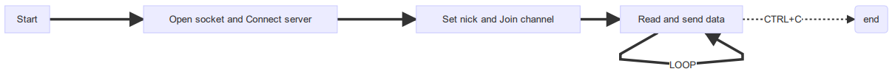
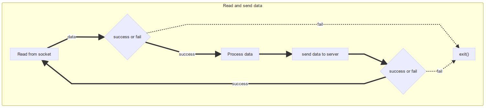
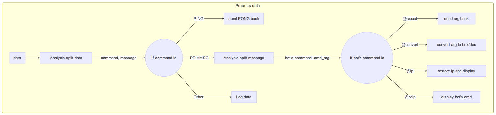

# IRC Robot - Report

## Program structure







## Challenge & Solution

1. 在家裡測試時，始終無法連上 freenode，在學校卻可以連上(Irssi 也一樣)
   * 經過查詢後發現可能是 SASL 的問題，但是在學校卻可以。
   * 最後想說學校可以的話，直接用 openvpn 連到系上網路後就正常了。

2. @convert hex to dec 命令

   * 原本的寫法是先把讀入的 hex string 轉成 dec int 再轉成 dec string
   * 後來才想到可以使用 `sscanf` 和 `sprintf` 的 `%x` 和 `%i` 可以輕鬆互相轉換

```c
char *remsg = malloc(512);
if (arg[1] == 'x' || arg[1] == 'X') {
    // hex to dec
    int num;
    sscanf(arg, "%x", &num);
    sprintf(remsg, "%i", num);
} else {
    // dec to hex
    int num;
    sscanf(arg, "%i", &num);
    sprintf(remsg, "0x%x", num);
}
return remsg;
```

```latex {cmd=true hide=true}
\documentclass{standalone}
\begin{document}
   Hello world!
\end{document}
```

## Reflections

由於之前 `系統程式設計` 這一堂課有教到 socket 的用法，作業也有出。再加上 `@ip` 的部分在 leetcode 也有寫過類似的題目，所以參考之前的 code 後，寫起來不是太困難，大概兩個小時就可以寫完了。

為了在更深入研究 irc 的結構，就嘗試寫寫看 irc server (簡單的 code 隨附在 server.c 裡面)。建立 socket 和 listen port 寫起來不難，但在開 thread 方面不是很輕鬆，最後還是看別人寫好的 code 研究。

收穫最大的是在找資料的過程，發現很多 socket 的應用方式，例如網頁即時遊戲(websocket)、外掛聊天室等等。