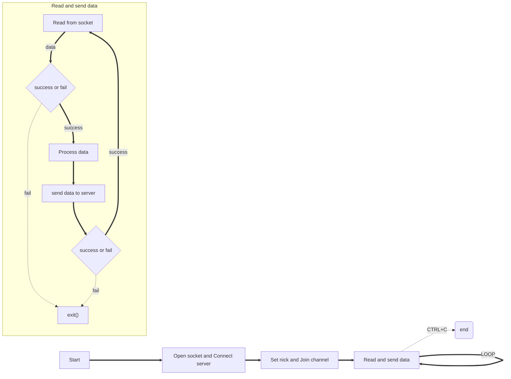
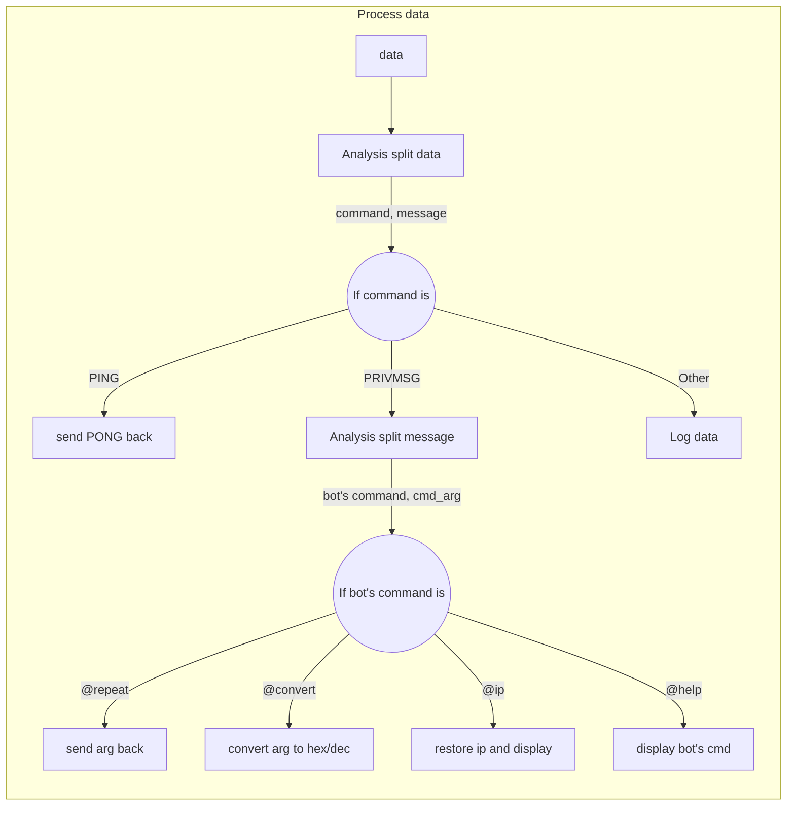

```mermaid
graph LR

    A[Start]==>B[Open socket and Connect server]
    B==>C[Set nick and Join channel]
    C==>D[Read and send data]
    D=="LOOP"==>D
    D-."CTRL+C".->E(end)
    subgraph Read and send data
        D1[Read from socket]=="data"==>D2{success or fail}
        D2==>|success|D3[Process data]
        D2-.->|fail|D4["exit()"]
        D3==>D5[send data to server]
        D5==>D6{success or fail}
        D6==>|success|D1
        D6-.->|fail|D4
    end
```

```mermaid
graph LR
    subgraph Process data
        E1[data]-->E2[Analysis split data]
        E2--"command, message"-->E3((If command is))
        E3-->|PING|E4[send PONG back]
        E3-->|PRIVMSG|E5[Analysis split message]
        E3-->|Other|E6[Log data]
        E5--"bot's command, cmd_arg"-->E7((If bot's command is))
        E7-->|"@repeat"|E8[send arg back]
        E7-->|"@convert"|E9[convert arg to hex/dec]
        E7-->|"@ip"|E10[restore ip and display]
        E7-->|"@help"|E11[display bot's cmd]
    end
```