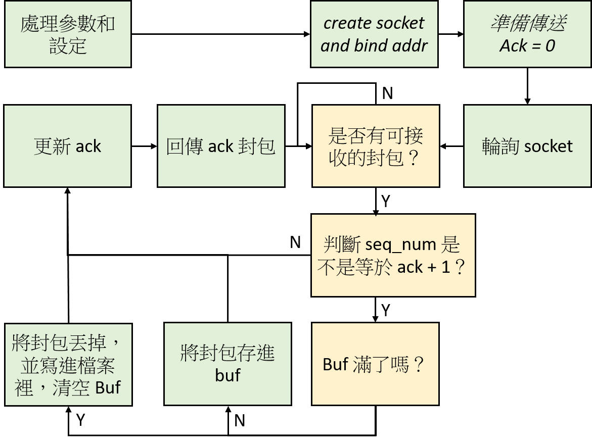

# HW2-Report

## How to execute your program

### config file

```
=== ip and port ===
SENDER_IP='127.0.0.1'
SENDER_PORT='19999'
AGENT_IP='127.0.0.1'
AGENT_PORT='20000'
RECEIVER_IP='127.0.0.1'
RECEIVER_PORT='20001'
=== other setting ===
THRESHOLD='16'
PKTDATASIZE='1024'
BUFFERSIZE='32'
TIMEOUT='500' // (unit:ms)
=== drop chance ===
// if CHANCE='x' ==> chance is "x/1000"
CHANCE='10'
```

###Compile

```
// To compile program with Makefile
$ make 
```

### execute

``` 
# ./receiver <save file dir> // ex: ./receiver ./
# ./agent
# ./sender <file's path> // ex: ./sender send_file.txt
```

## Program structure

### sender


### agent


### receiver



## Challenge & Solution

1. 嘗試檢驗 Time out 的方法
   * 第一個方法是使用 signal 去計時，但是如果 recv_from 在 wait 的狀態下接 signal，recv_from 會 return error，又很不巧剛好是在 read 資料的話，資料會讀爛。 
   * 第二個方法是先用 select 判斷有沒有資料可以讀，在使用 time() 這個函式去紀錄時間，計算時間差，進而判斷有沒有 time out。

2. 開檔讀寫的的問題

   * 我不小心誤會 fread 和 fwrite 的參數意義，造成傳書的資料本身就是錯的，但是出錯時一直以為式傳輸資料有問題，解了一個下午才發現...
3. 在使用 socket select 的時候，要好好地把 fd_set 設成 fd_zero 在做操作，否則會發生不可預期的錯誤

## Reflections

和 hw1 一樣是關於 socket programming 的問題，所以不難，按照思路慢慢寫就能寫出來了。

不過有學習到 UDP 去模擬 reliable transmission 的方法，覺得寫作業寫起來蠻開心的。/